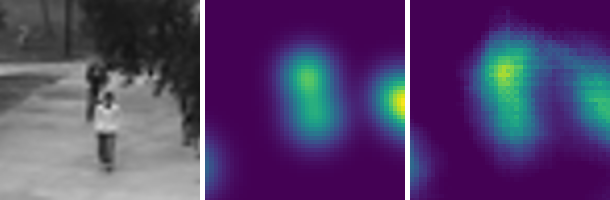
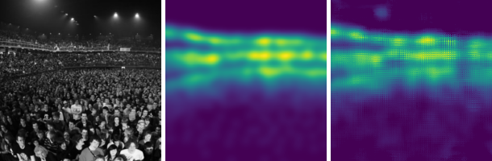

# counting

## Introduction

This is a repository containing an implementation of the AMDCN (aggregated multicolumn dilated convolution network) from [1] for learning to count objects in images (instructions provided for crowd and traffic datasets).

The architecture of the AMDCN consists of five parallel columns consisting of dilated convolutions and a final aggregator (another series of dilated convolutions) which takes the concatenated features from the columns and outputs the final density map. An image of the architecture is shown below:


The numbers below each convolution kernel show the dilation rate for that particular kernel. Kernels start at either ``3x3`` or ``5x5`` as shown.

The following images are example outputs from the network on the UCSD, UCF50, and TRANCOS datasets, respectively. From left to right, each image shows the input image, the ground truth density map, and the AMDCN predicted density map. Note that during actual usage of the model during experiments, we sometimes densely scan overlapping patches or take non-overlapping patches rather than inputting whole images which means that the output density maps may not always look as clean (though accuracy will be higher). For full details on which datasets are tested as full images and which are patched, please see the paper [1].






These results are from our paper published at the [Visual Understanding of Humans in Crowd Scene Workshop](https://vuhcs.github.io/) at CVPR 2018.

## Usage

### Requirements

We assume basic familiarity with Python and TensorFlow. You will need to have the following installed:

```
Python 3
TensorFlow with CUDA support
keras
h5py
numpy
scipy
tqdm
skimage

MATLAB (only for the WorldExpo dataset experiments)
```

### Setting up the data files

The training scripts for this implementation are set up to expect HDF5 files as input. In order to create these files for the same datasets we provide scripts for each dataset in the ``data`` folder. Explanations for how to set up the folder structure for each dataset and the usage for each script is shown for each separate dataset below.

#### UCSD

Make sure to set up the following directories as shown. The label images should be named as ``vidf1_33_00nfxyzdots.png`` where ``vidf1_33_00nfxyz`` is the original image name. Once the label images are in ``data/UCSD/B/``, run the included ``blur.py`` in ``data/UCSD/B/`` which will generate the ground truth density maps. You can also use ``perspective_blur.py`` if you would like to generate density maps with perspective scaling. These scripts assume that they will be called from within ``data/UCSD/B/``. After generating the density maps, call ``get_data.py`` which will gather the four splits of UCSD used by a majority of other papers. Then, call ``get_original.py`` which will gather the original split of the UCSD data.

Use ``patch_extractor.py`` to generate the train and test HDF5 files for the first four splits of UCSD. In order to generate the train and test files for each different split, edit lines ``23-26`` as appropriate to load the data from the right folders. For the original split, simply run ``original_split_patch_extractor.py``.

```
data/
    UCSD/
        A/
            (put *.png input files from UCSD dataset here)
        B/
            blur.py
            perspective_blur.py
            (put *.png label files from UCSD dataset here)
        A_minimal/
        A_minimal_testing/
        A_maximal/
        A_maximal_testing/
        A_downscale/
        A_downscale/testing/
        A_upscale/
        A_upscale_testing/
        A_original/
        A_original_testing/
        B_minimal/
        B_minimal_testing/
        B_maximal/
        B_maximal_testing/
        B_downscale/
        B_downscale/testing/
        B_upscale/
        B_upscale_testing/
        B_original/
        B_original_testing/
        get_data.py
        get_original.py
        patch_extractor.py
        original_split_patch_extractor.py
```

#### UCF50

Make sure to set up the following directories as shown. The label images should be named as ``ndots.png`` where ``n`` is the original image number. Once the label images are in ``data/UCF/B/``, run the included ``blur.py`` in ``data/UCSD/B/`` which will generate the ground truth density maps. You can also use ``geometric_blur.py`` if you would like to generate density maps with geometric scaling (see [1] for details). These scripts assume that they will be called from within ``data/UCF/B/``. After generating the density maps, call ``get_data.py`` which will gather the five cross validation splits of UCF50 used by other papers.

Use ``patch_extractor.py`` to generate the train and validation (labeled as test) HDF5 files for the five splits of UCF. In order to generate the train and test files for each different split, edit lines ``27-30`` as appropriate to load the data from the right folders. To generate the full image testing HDF5 file, simply run ``full_image_test_extractor.py``.

```
data/
    UCF/
       A/
           (put *.jpg input files from UCF dataset here)
       B/
           blur.py
           geometric_blur.py
           (put *.png label files from UCF dataset here)
       A_0/
       A_0_testing/
       A_1/
       A_1_testing/
       A_2/
       A_2_testing/
       A_3/
       A_3_testing/
       A_4/
       A_4_testing/
       B_0/
       B_0_testing/
       B_1/
       B_1_testing/
       B_2/
       B_2_testing/
       B_3/
       B_3_testing/
       B_4/
       B_4_testing/
       get_data.py
       patch_extractor.py
       full_image_test_extractor.py
```

#### WorldExpo

**COMING SOON**

#### TRANCOS

**COMING SOON**

### Running a train or test session

All source code for defining the models and actually running the training is in ``amdcn``. The training and testing scripts are already implemented as ``train_model.py`` and ``test_model.py`` respectively. These scripts both take the argument ``--model`` which specifies the desired network architecture.

Different network architectures (models) are listed in ``models.py``. To load a specific model, change the ``--model`` argument for ``train.py`` to the appropriate model in ``models.py``. You likely want the model ``parallel_aggregate`` if you want to run the AMDCN. For both training and testing, when requesting a model, the following arguments are available:

```
--model_type',        default='baseline',
                      help='Model type (baseline, context)'
--num_channels',      type=int, default=32,
                      help='Number of channels in model'
--num_layers',        type=int, default=3,
                      help='Number of layers in model (baseline only)'
```

The train script specifically takes the following arguments:

```
--train_path,         default='train.hdf5',
                      help='Input path for pre-processed training data and labels'
--val_path,           default='val.hdf5',
                      help='Input path for pre-processed validation data and labels'
--output_path,        default='model.hdf5',
                      help='Output path for model weights'
--log_path,           default='logs/UCSD/upscale/',
                      help='Output path for TensorFlow logs'
--gpu_frac',          type=float, default=0.,
                      help='Fraction of GPU memory to allocate (TensorFlow only)'
--tile_size',         type=int, default='-1',
                      help='Tile size: -1 for no tiling, 1 for patches, n>1 for nxn tiles'
--batch_size',        type=int, default=32,
                      help='Batch size'
--batches_per_epoch,  type=int, default=100,
                      help='Number of batches in an epoch'
--num_epochs,         type=int, default=10,
                      help='Number of epochs'
--learning_rate,      type=float, default=0.01,
                      help='Use balanced sampling of patches'
```

The test script specifically takes the following arguments:

```
--data_path,          default='test.hdf5',
                      help='Input path for preprocessed data and labels'
--model_path,         default='model.hdf5',
                      help='Input path for model weights'
--output_path,        default='output/',
                      help='Output path for images generated by model'
--gpu_frac,           type=float, default=0.,
                      help='Fraction of GPU memory to allocate (TensorFlow only)'
```


### Replicating experiments from [1]

For examples of calling both the training and testing scripts, please see the ``experiment`` script. The usage for this script is as follows (when called from the ``amdcn`` folder):

```
usage: ./experiment train/test/process dataset
  train/test/process: whether to train, test, or apply preprocessing to data
  dataset: ucsd_upscale / ucsd_maximal / ucsd_minimal / ucsd_downscale / ucsd_original / trancos / ucf_0 / ucf_1 / ucf_2 / ucf_3 / ucf_4 / worldexpo
```

In order to replicate the experiments, you should first move the appropriate ``train/test/val.hdf5`` files from the respective ``data`` folder to the equivalent folder in ``amdcn``. Then, run the ``process`` command in the ``experiment`` script for the desired dataset. After this, you should not have to run the process script anymore, and can run ``train`` and ``test`` as desired. Make sure that there is an ``output`` folder in the ``amdcn`` folder as shown below:

```
amdcn/
     output/
           UCSD/
               upscale/
               downscale/
               maximal/
               minimal/
               original/
           UCF/
              0/
              1/
              2/
              3/
              4/
           WorldExpo/
           TRANCOS/
```

### Obtaining counts from density maps

Scripts to integrate density maps and output counts can be run after testing is complete. The scripts included in the ``scripts`` directory are ``sliding_window_integrator.py``, ``full_image_integrator.py``, and ``quadrant_integrator.py``.

The ``sliding_window_integrator.py`` script has the following arguments:

```
--input_path,  default='./',
               help='Folder of images to test integrate over.'
--num_images,  type=int, default=599,
               help='Number of test images.'
--height,      type=int, default=576,
               help='Height of test images.'
--width,       type=int, default=720,
               help='Width of test images.'
--patch_size,  type=int, default=150,
               help='Patch size used in testing.'
--stride,      type=int, default=100,
               help='Stride used to densely scan the image.'
--output_path, default='results.csv',
               help='Output path for the file containing the counts.'
```

The ``full_image_integrator.py`` script has the following arguments:

```
--input_path,  default='./',
               help='Folder of images to test integrate over.'
--num_images,  type=int, default=50,
               help='Number of test images.'
--height,      type=int, default=1024,
               help='Height of test images.'
--width,       type=int, default=1024,
               help='Width of test images.'
--patch_size,  type=int, default=256,
               help='Patch size used in testing.'
--output_path, default='results.csv',
               help='Output path for the file containing the counts.'
```

The ``quadrant_integrator.py`` script has the following arguments:

```
--input_path,  default='./',
               help='Folder of images to test integrate over.'
--output_path, default='results.csv',
               help='Output path for the file containing the counts.'
```

#### UCSD

Run ``quadrant_integrator.py`` with the desired arguments to ``input_path`` and ``output_path``. No other arguments or changes are required.

Note that output for the desired split of UCSD must have been run prior to running this script.

#### UCF

Run ``full_image_integrator.py`` with the desired arguments to ``input_path`` and ``output_path`` and the following arguments for image size:

```
height = 1024
width = 1024
num_images = 50
```

Unlike the other datasets, this will output for all images (both training and testing sets). To determine test performance, you must pick out the desired test images.

Note that output for all splits of UCF must have been run prior to running this script.

#### WorldExpo

**COMING SOON**

#### TRANCOS

**COMING SOON**


### Using custom training/testing datasets

In order to use custom datasets, you'll need to package your input in an HDF5 file. See the example scripts provided in the specific dataset folders in ``data``. The resulting HDF5 file should have the following datasets:

```
file.hdf5/
         data/array with shape (number of images, height, width, channels)
         label/array with shape (number of images, height, width, channels=1)
```

We expect ``np.float32`` arrays for these datasets.

### Visualizing dataset

We have provided a few (hacky) scripts for viewing data. These are located in the ``scripts`` directory of this repository.


**[1]**: Deb, Diptodip, and Jonathan Ventura. "An Aggregated Multicolumn Dilated Convolution Network for Perspective-Free Counting." *Proceedings of the IEEE Conference on Computer Vision and Pattern Recognition Workshops. 2018.*

http://openaccess.thecvf.com/content_cvpr_2018_workshops/papers/w6/Deb_An_Aggregated_Multicolumn_CVPR_2018_paper.pdf
